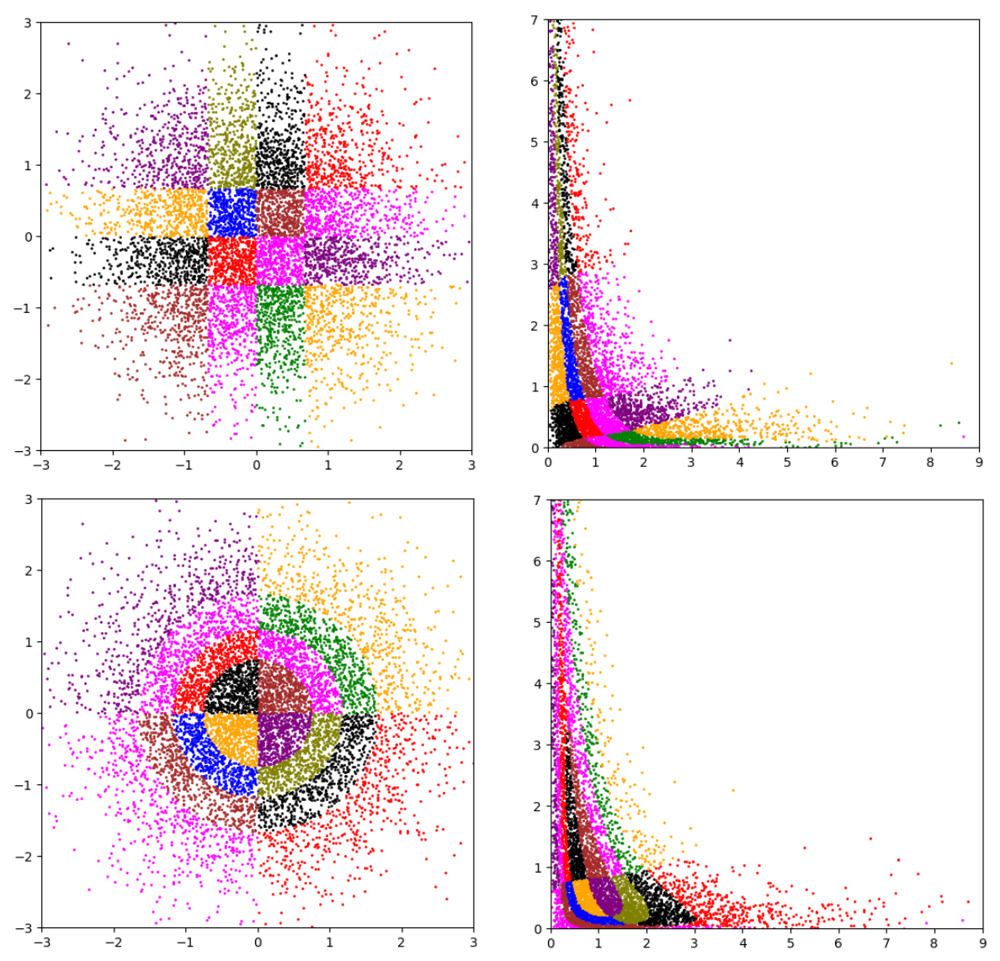

# FlowStrat
Reducing Estimation Uncertainty Using Normalizing Flows and Stratification.

<div style="text-align: center;">

</div>

# Installation

## Conda env
```
conda env create -f conda.yml -n flowstrat
conda activate flowstrat
```

## Packages installation
```shell
poetry update
poetry install
```
[//]: # (see [Wiki->Installation]&#40;../../wiki/installation&#41; for development installation.)

# Experiments

All our experiments are implemented as [Kedro](https://kedro.org) pipelines.

Each pipeline corresponds to a particular scenario in the paper 
and consists of the following steps (see Figure below):
1. Dataset generation
2. Model training
3. Model evaluation
4. Presentation of the results


## Scenario run

Each scenario can be run separately by specifying the corresponding pipeline name.
> `kedro run --pipeline <pipeline_name>`

Warning: this may overwrite the results of the previous run, especially the 
initial data and the trained models, given in the ZIP package.

Each scenario has its own configuration file in `conf/base/parameters/` folder.
The `base` environment is used by default, but you can specify another one with
the option `--env <name>`.

We prepared the `base` environment with very simplified parameters setup
for the sake of easy and quick run, especially for testing purposes.

In order to **reproduce** the results in the paper, one should use the 
original data in ZIP package, i.e. the files in `data/` folder.
Moreover, one should use the parameters given in the **comments** in the configuration files.

Warning: the experiments can take a long time to run, depending on the parameters.


## Running the pipeline step by step

Instead of running the full pipeline, 
one can run it only for a particular step:
* `kedro run --pipeline $SCENARIO --to-nodes $SCENARIO.generate_dataset` --- only step 1, i.e. generate the training dataset
* `kedro run --pipeline $SCENARIO --to-nodes $SCENARIO.train_model` --- steps 1. and 2., i.e. from dataset generation to model training
* `kedro run --pipeline $SCENARIO --from-nodes $SCENARIO.evaluate_model` --- steps 3. and 4., assuming you have trained the model, one can run this command in order to evaluate it
* `kedro run --pipeline $SCENARIO --from-nodes $SCENARIO.print_results` --- step 4, in order to print the results only (assuming you have evaluated the model before)
where `$SCENARIO` is the name of the scenario; see below for the list of scenarios.

## 1D data - (Example 1 in the paper)

The scenario name is `scenario1d`.

### Run
The scenario can be run with the following command:
```bash
kedro run --pipeline scenario1d
```
 see parameters in [conf/base/parameters/scenario1d.yml](conf/base/parameters/scenario1d.yml)
in order to reproduce the experiment with different parameters.

In the figure below we depict the pipeline structure for the scenario `scenario1d`:


All the intermediate results are saved in the folder `data/scenario1d/`:
1. Dataset generation -> `data/scenario1d/dataset_train.pkl` (samples from the base distribution)
2. Model training -> `data/scenario1d/model.pt` (trained flow model, PyTorch format)
3. Model evaluation -> `data/scenario1d/evaluation.pkl` (results of the experiment)
4. Results visualization

### Results
You can reproduce the results in Table 1, provided that all initial data is given in the `data/scenario1d/` folder::
* `dataset_train.pkl` - data used for model training; 
* `model.pt` - pretrained model; 
* `evaluation.pkl` - evaluation metrics; 

```bash
kedro run --pipeline scenario1d --from-nodes scenario1d.print_results
```

The sample output looks like this:
```
***
method: regular  -- method M1 in the paper

Y^{OPT} - optimal stratified sampling
{'gt_0.95': {'acc': 2.829246100982245,
             'est': 0.0649947166442871,
             'std': 2.389638485539464e-05},
 'lt_0.95': {'acc': 3.9974000087482366,
             'est': 0.9350033521652221,
             'std': 2.390493113134462e-05},
 'lt_0.99': {'acc': 2.42309290215503,
             'est': 0.9837549686431885,
             'std': 5.353876482645727e-05},
 'rho1': {'acc': 2.8113318769250855,
          'est': 0.89052737,
          'std': 2.2721950109933933e-05},
 'rho2': {'acc': 3.015254128061488,
          'est': 0.40356845,
          'std': 1.7124236897567813e-05},
 'rho3': {'acc': 2.9442186445551504,
          'est': 2.9207675,
          'std': 0.00013596441028826574}}
```

Note that we report, in Table 1, the
values `est`, `100*std` and `acc` that are rounded to 3 digits after the decimal point.

## 2D data - `scenario2d` and `scenarioWind2d`

We prepared two scenarios with 2D data.
The first is an example with synthetic data (see Example 2 in the paper), 
and the second is an example with real data (see Example 5 in the paper).

The scenario names are `scenario2d` and `scenarioWind2d`.

One can run the scenarios with the following command:
```bash
kedro run --pipeline scenario2d
kedro run --pipeline scenarioWind2d
```
see parameters in [conf/base/parameters/scenario2d.yml](conf/base/parameters/scenario2d.yml)
and [conf/base/parameters/scenarioWind2d.yml](conf/base/parameters/scenarioWind2d.yml)

All the intermediate results are saved in the folders `data/scenario2d/` and `data/scenarioWind2d/`.

## 3d data - `scenarioTS3d` (Example 3 in the paper with `d=3`)

The scenario name is `scenarioTS3d`.

One can run the scenario with the following command:
```bash
kedro run --pipeline scenarioTS3d
```

This pipeline has the following steps:
1. Dataset generation - `generate_dataset`
2. Model training - `train_model`
3. Model evaluation - `evaluate_model`

All the parameters are given in [conf/base/parameters/scenarioTS3d.yml](conf/base/parameters/scenarioTS3d.yml)
Again, please change the values in the configuration file (see comments) 
in order to reproduce the results in the paper.

In the folder `data/scenarioTS3d/` you can find the following files:
1. `dataset_train.pkl` - data used for model training;
2. `model.pt` - pretrained model;
3. `evaluation.pkl` - evaluation metrics


---
# References
* [Wiki](../../wiki)
